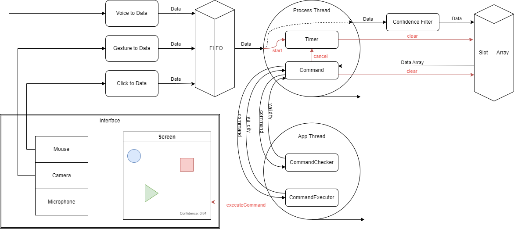

# Multimodal Fusion

## Context
*******************
This project was developed by the team consisting of [Constant Roux](https://github.com/ConstantRoux) and 
[Larissa Xavier Vitor](https://github.com/larissaxv), both in their final year at UPSSITECH engineering school, 
specializing in robotics. The project is an integral part of the Human-Computer Interaction (HCI) course instructed by 
[Philippe Truillet](https://github.com/truillet).

The project explores the use of a multimodal fusion engine in the field of Human-Computer Interaction. To learn more 
about the course and access the source code, please visit the GitHub repository associated with the project: 
[Multimodal Human-Machine Interaction](https://github.com/truillet/upssitech/tree/master/SRI/3A/IHM).

## Presentation
*******************

### &rarr; General principle


The system operates based on the following general principles:

1. **Data Transmission from Interfaces to FIFO:**
   1. Position data from mouse clicks.
   2. Text data generated through voice input using a microphone and a language model.
   3. Shape data from the camera (gesture detection).
   
2. **Process Thread Operation:**
   1. The Process Thread reads data from the FIFO and stores it in the Slot Array, a table containing the latest received data (this table is periodically reset).
   2. It attempts to generate a possible command and verifies its coherence by communicating with the AppThread, which manages the application and its interface.

3. AppThread Execution:
   1. The AppThread examines the commands to be sent and executes them.
   2. It has the capability to manage all shapes present on the screen.

For more detailed information, please refer to the project report provided in the project source code.

### &rarr; Functionalities
The project encompasses the following key functionalities:
1. **Create a Shape:**
    1. Generate a shape from the selection of circle, rectangle, or triangle.
    2. Assign a specific color to the shape, choosing from options like red, green, or blue.
    3. Place the newly created shape at a designated location.

2. **Delete an Existing Shape:**
   1. Remove a previously created shape from the interface.

3. **Move an Existing Shape:**
   1. Adjust the position of an existing shape to a new location on the screen.

4. **Quit the Application:**
   1. Exit the application, terminating its execution.

## Getting started
*******************

### &rarr; Dependencies
Make sure you have the following dependencies installed before running the project:
- **Windows OS:** This project is designed to run on the Windows operating system.
- **Processing:** The OneDollarIvy component of the project requires the Processing software. You can download Processing from [processing.org](https://processing.org/download/).
- **Python 3.x:** The project requires Python 3.0 or a later version.
- **NumPy:** NumPy is a fundamental package for scientific computing with Python. To install it, use the following command:
    ```
    sudo pip install numpy
    ```
- **Ivy-Python:** Ivy is a custom software bus used in this project. To install it, use the following command:
    ```
    sudo pip install ivy-python
    ```

### &rarr; Installation
To get started with this projet, simply clone this project by using the following command:
```
git clone https://github.com/ConstantRoux/multimodal-fusion.git
```

### &rarr; Usage
Follow these steps to use this project:
1. **Launch Ivy Visionneur:** Execute the `visionneur.bat` file located in `agent/libraries/visionneur`:
   ```bash
   cd agent/libraries/visionneur
   visionneur.bat
   ```
   
2. **Launch Sra5:** Execute the `sra5.exe` file located in `agent/libraries/sra5`:
   ```bash
   cd agent/libraries/sra5
   sra5.exe
   ```
   
3. **Run OneDollarIvy from Processing:** Open the Processing software and load the `OneDollarIvy` file located in `agent/libraries/OneDollarIvy`.

4. **Run the Main Project:** Execute the following command to run the main project:
    ```
    python main.py
    ```

## Demonstration
*******************
